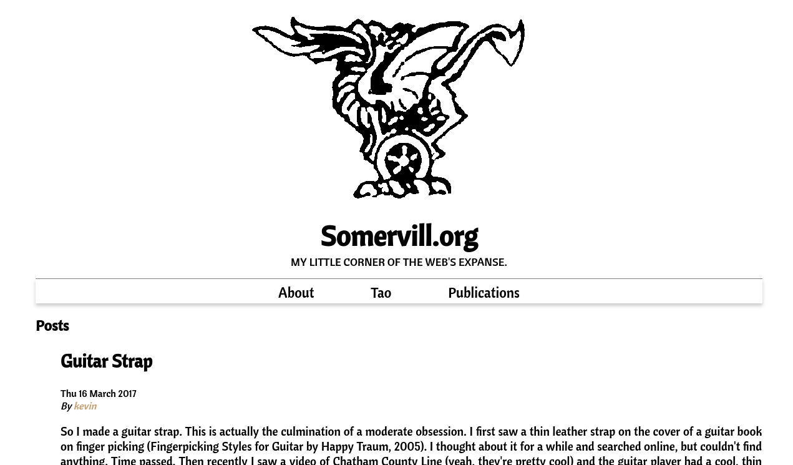

# Wizard

Wizard is a [pelican](https://github.com/getpelican/pelican) theme
based on the [simple
theme](https://github.com/getpelican/pelican/tree/master/pelican/themes/simple)
provided as a reference in the source code.

The theme supports a few configuration items set in the pelicanconf file:
- `SITE_LOGO` - to set a picture in the banner (make sure to include where to
  find the image
- `SITE_SUBTITLE` - short subheading or subtitle for your site.
- `COPYRIGHT` - short copyright notice

To recreate the css file:

    pyscss -C ../scss/base.scss > wizard.css
